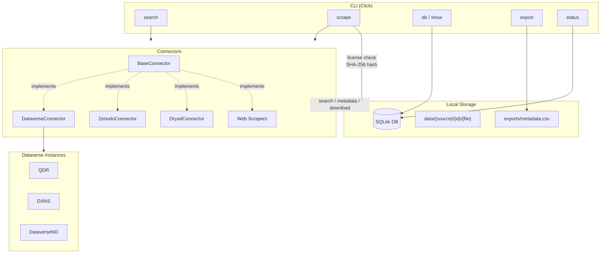

<div align="center">

# Seeding QDArchive

**Acquire, catalog, and classify open qualitative research data for the [QDArchive](https://qdarchive.org) web service.**

[](https://python.org)
[](https://pdm-project.org)
[](https://docs.astral.sh/ruff/)

---

_Academic project (10 ECTS) — FAU Erlangen-Nurnberg_

</div>

## Overview

This pipeline searches open qualitative data repositories, downloads files and metadata, stores everything in a local SQLite database, and exports results for further analysis. It targets **QDA project files** (REFI/qdpx, MAXQDA, NVivo, ATLAS.ti, Dedoose, QDAcity, QDA Miner) and **general qualitative data** (interview transcripts, research articles).

The project has two parts:

|       | Phase               | Deliverable                      | Deadline |
| ----- | ------------------- | -------------------------------- | -------- |
| **1** | Data Acquisition    | Metadata DB + downloaded files   | March 15 |
| **2** | Data Classification | Merged DB with ISIC Rev. 5 codes | April 12 |

## Data Sources

| Source                                         | Type    | Coverage                        |
| ---------------------------------------------- | ------- | ------------------------------- |
| [Zenodo](https://zenodo.org)                   | API     | Open research repository        |
| [Dryad](https://datadryad.org)                 | API     | Digital data repository         |
| [Dataverse](https://dataverse.org)             | API     | QDR, DANS, DataverseNO          |
| [UK Data Service](https://ukdataservice.ac.uk) | Scraper | UK national data archive        |
| [QualidataNet](https://qualidata.net)          | Scraper | Qualitative data network        |
| [Qualiservice](https://qualiservice.org)       | Scraper | German qualitative data service |

## Quick Start

### Prerequisites

- Python 3.10+
- [PDM](https://pdm-project.org) package manager

### Installation

```bash
git clone git@github.com:prantoamt/seeding-QDArchive.git && cd seeding-QDArchive
pdm install
```

### Usage

```bash
pdm run pipeline search qdr -q "qualitative"        # Search QDR
pdm run pipeline scrape qdr -f queries.txt -n 10     # Scrape with query file
pdm run pipeline db --qda-only                       # Browse QDA files
pdm run pipeline show 6 49 50                        # Inspect records
pdm run pipeline status                              # Collection progress
pdm run pipeline export                              # Export to CSV
```

> **Full CLI documentation:** See [manual.md](manual.md) for all commands, options, and examples.

## Architecture



## Project Structure

```
src/pipeline/
├── cli.py                  # Click CLI entry point
├── config.py               # Paths, constants, QDA extensions
├── connectors/
│   ├── base.py             # Abstract BaseConnector interface
│   └── dataverse.py        # Dataverse API connector (QDR, DANS, DataverseNO)
├── db/
│   ├── models.py           # SQLAlchemy models (files table)
│   ├── connection.py       # DB engine and session management
│   └── export.py           # CSV export
├── storage/
│   └── file_manager.py     # File organization + SHA-256 hashing
└── utils/
    ├── logging.py           # Rich console + file logging
    └── license.py           # Open license validation
```

**Data layout on disk:**

```
data/{source_name}/{record_id}/{filename}
```

## Development

```bash
pdm run pytest               # Run tests
pdm run ruff check src/      # Lint
pdm run ruff format src/     # Format
```

## Tech Stack

| Tool                                                             | Role                             |
| ---------------------------------------------------------------- | -------------------------------- |
| [httpx](https://www.python-httpx.org/)                           | HTTP client for API calls        |
| [Click](https://click.palletsprojects.com/)                      | CLI framework                    |
| [SQLAlchemy](https://www.sqlalchemy.org/)                        | ORM for SQLite metadata DB       |
| [Beautiful Soup](https://www.crummy.com/software/BeautifulSoup/) | HTML scraping                    |
| [Rich](https://rich.readthedocs.io/)                             | Terminal formatting and progress |
| [Ruff](https://docs.astral.sh/ruff/)                             | Linting and formatting           |
| [pytest](https://docs.pytest.org/)                               | Testing                          |
