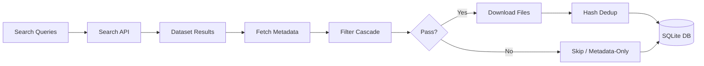
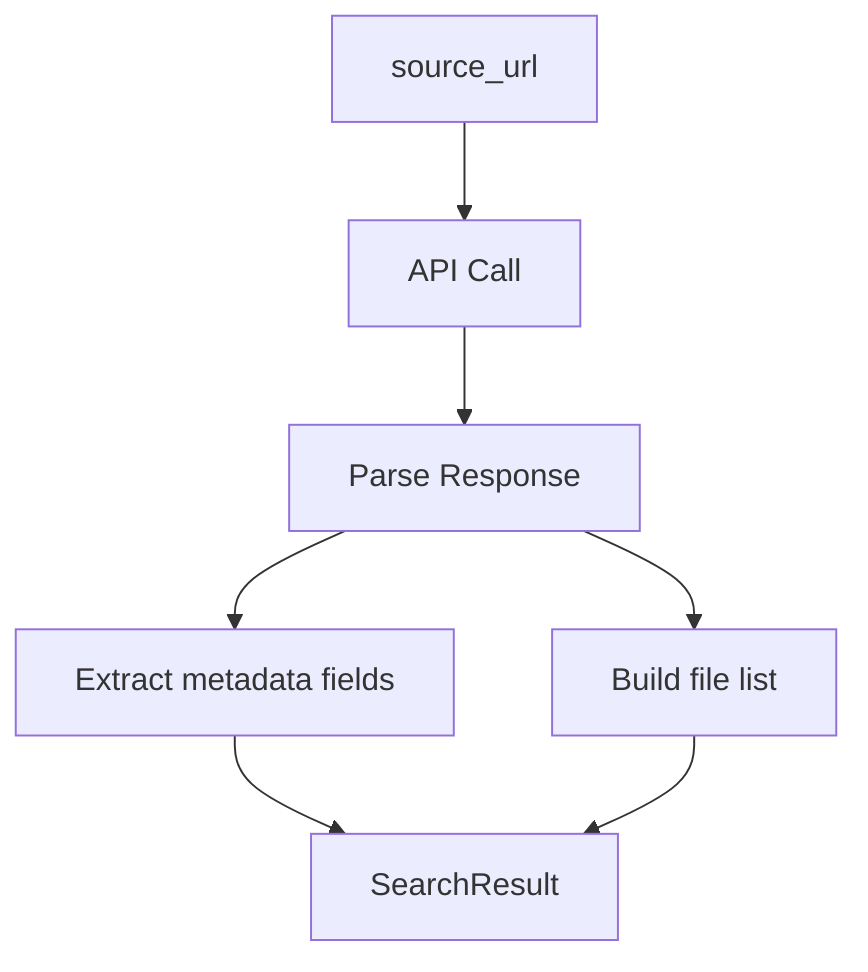
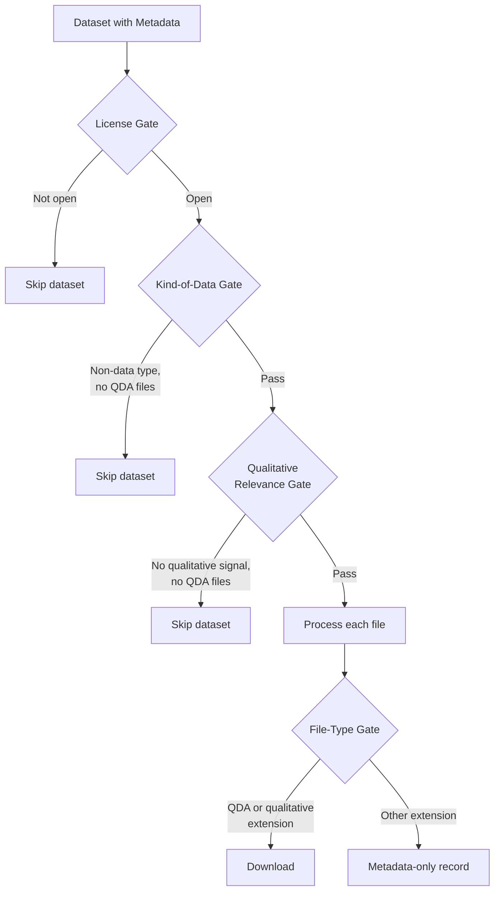
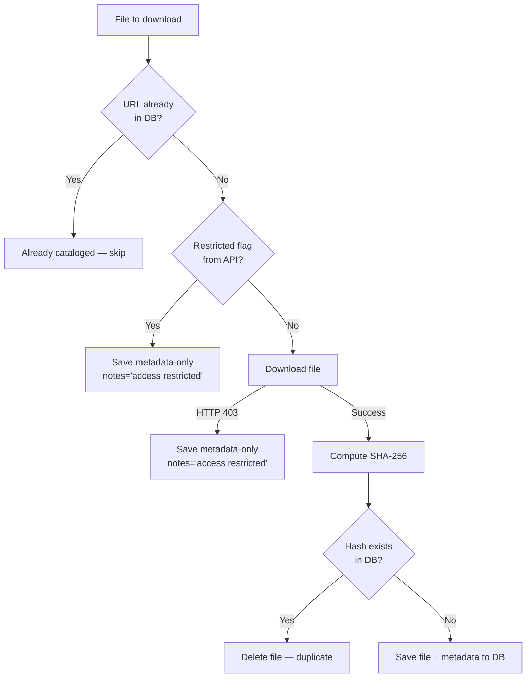

# Scraping Algorithm

## Table of Contents

- [1. Overview](#1-overview)
- [2. Entry Points](#2-entry-points)
- [3. Query Loading](#3-query-loading)
  - [Search query design](#search-query-design-queriestxt)
- [4. Search Phase](#4-search-phase)
- [5. Metadata Fetch](#5-metadata-fetch)
- [6. Filter Cascade](#6-filter-cascade)
- [7. Download & Deduplication](#7-download--deduplication)
- [8. Record Storage](#8-record-storage)
- [9. Error Handling](#9-error-handling)
- [10. Reference](#10-reference)

## 1. Overview

The pipeline searches open qualitative data repositories, applies a multi-stage filter cascade to identify relevant datasets, downloads qualifying files, deduplicates by content hash, and stores rich metadata in SQLite. The goal is to collect **QDA files** (`.qdpx`, `.mx`, `.nvpx`, etc.) and **qualitative data** (`.txt`, `.pdf`, `.rtf`, `.docx`) from seven repositories across five countries.



## 2. Entry Points

### `scrape <source>`

Scrapes a single source. Supports `--query` (single search term), `--queries-file` (file with one query per line), and `--limit` (max datasets per query).

```
pdm run pipeline scrape qdr --query "interview" --limit 50
pdm run pipeline scrape zenodo --queries-file queries.txt
```

### `scrape-all`

Iterates all connectors from the registry sequentially. Defaults to `queries.txt` if present in the project root. Failed sources are retried up to `--retries` times (default 1).

```
pdm run pipeline scrape-all --queries-file queries.txt --limit 100 --retries 2
```

## 3. Query Loading

The function `_load_queries()` resolves search terms in priority order:

| Priority | Source | Behavior |
|----------|--------|----------|
| 1 | `--queries-file` | Reads file line-by-line; strips blank lines and `#` comments |
| 2 | `--query` | Single string wrapped in a list |
| 3 | Default | `["qualitative"]` |

### Search query design (`queries.txt`)

The default query file uses a two-pass strategy to maximize recall while keeping results relevant to qualitative research.

**First pass — QDA-specific queries** target datasets that directly involve qualitative data analysis software or file formats:

| Query | Rationale |
|-------|-----------|
| `qdpx`, `REFI-QDA` | The REFI-QDA standard interchange format. Any dataset mentioning these almost certainly contains a QDA project file. |
| `NVivo`, `ATLAS.ti`, `MaxQDA`, `Dedoose`, `QDAcity`, `QDA Miner`, `QualCoder` | The major CAQDAS (Computer-Assisted Qualitative Data Analysis Software) tools. Researchers cite the software they used in dataset descriptions, making these high-precision search terms. |
| `CAQDAS` | The umbrella acronym for the software category itself. |
| `coded transcript` | A transcript that has undergone qualitative coding — strong signal that QDA was performed on the data. |

**Second pass — qualitative data queries** target the raw data that QDA is performed on, using established methodology terms from qualitative research:

| Query | Rationale |
|-------|-----------|
| `interview transcript`, `semi-structured interview`, `focus group`, `in-depth interview`, `biographical interview`, `life history interview` | The most common qualitative data collection methods. These are standard terms in social science methodology textbooks (Bryman, 2016; Creswell & Poth, 2018). |
| `grounded theory`, `thematic analysis`, `narrative analysis`, `interpretative phenomenological`, `interpretive research` | Recognized qualitative analysis methodologies. Researchers tag their datasets with the methodology they employed. |
| `qualitative research`, `qualitative data`, `qualitative coding`, `codebook qualitative` | Direct references to the qualitative paradigm. |
| `ethnography`, `participant observation`, `action research qualitative` | Fieldwork-based qualitative approaches that produce rich textual data. |
| `open-ended responses`, `open-ended questions` | Survey instruments with qualitative components — these generate textual data suitable for QDA. |
| `mixed methods qualitative` | Mixed-methods studies that include a qualitative component alongside quantitative analysis. |

**Multilingual queries** are translations of the core terms, targeted at repositories that serve non-English-speaking research communities:

| Language | Target repositories | Example queries |
|----------|-------------------|-----------------|
| German | Zenodo, QualidataNet | `qualitative Forschung`, `Leitfadeninterview`, `Gruppendiskussion` |
| Dutch | DANS | `kwalitatief onderzoek`, `diepte-interview`, `transcriptie interview` |
| Norwegian | DataverseNO | `kvalitativ forskning`, `dybdeintervju`, `fokusgruppe` |
| Spanish | Zenodo | `investigación cualitativa`, `entrevista cualitativa`, `grupo focal` |
| French | Zenodo | `recherche qualitative`, `entretien qualitatif`, `analyse thématique` |
| Portuguese | Zenodo | `pesquisa qualitativa`, `entrevista qualitativa`, `análise temática` |

These translations were chosen because each target repository hosts significant content in the respective language. Without them, non-English qualitative datasets would be invisible to the pipeline.

## 4. Search Phase

Each connector implements `BaseConnector.search(query) -> list[SearchResult]`, returning dataset-level results with a `source_url` identifying each dataset.

**Cross-query deduplication:** A `seen_urls` set tracks every `source_url` encountered. If a dataset was already returned by a previous query, it is silently skipped. This prevents processing the same dataset multiple times when queries overlap (e.g., "qualitative interview" and "interview transcript" may match the same dataset).

**Per-query limit:** If `--limit N` is set, only the first N new (unseen) datasets per query are processed.

### Connector-specific search behavior

| Connector | API | Pagination | Rate limit | Max results |
|-----------|-----|------------|------------|-------------|
| **Dataverse** (QDR, DANS, DataverseNO, Harvard, SODHA) | Dataverse Search API (`/api/search`) | 100 results/page, offset-based | None | 500 |
| **Zenodo** | REST API (`/api/records`) | 25 results/page, page-based | 2s between requests | 200 |
| **UK Data Service** | EPrints JSON export (`export_reshare_JSON.js`) | Single request returns all matches | 2s between requests | Unlimited |

**Dataverse filter:** Harvested datasets are excluded via `fq=-isHarvested:true` to avoid 401 errors when fetching metadata from datasets that are indexed but hosted elsewhere.

## 5. Metadata Fetch

For each dataset that passes cross-query dedup, the pipeline calls `connector.get_metadata(source_url)`, which returns a fully populated `SearchResult` including:

- **Dataset-level:** title, description, authors, license, keywords, kind_of_data, language, software, geographic_coverage, depositor, producer, publication references
- **File list:** each file as a dict with `name`, `download_url`, `size`, `content_type`, `friendly_type`, `restricted` flag, `api_checksum`



## 6. Filter Cascade

After metadata is fetched, each dataset passes through four sequential gates. Failing any gate skips the dataset (or individual file).



### Gate 1 — License

`is_open_license()` normalizes the license string and checks it against a whitelist of open license prefixes:

- **CC variants:** CC-BY, CC-BY-SA, CC-BY-NC, CC-BY-NC-SA, CC-BY-ND, CC-BY-NC-ND
- **Public domain:** CC0, Public Domain
- **Open data:** ODC-BY, ODC-ODbL, ODC-PDDL
- **Software:** MIT, Apache-2.0
- **Special:** Standard Access (QDR's access model — data is free for registered users)

No license or unrecognized license → **skip entire dataset**.

### Gate 2 — Kind of Data

If the dataset's `kind_of_data` field matches any value in `SKIP_KIND_OF_DATA` (10 types: publication, presentation, poster, lesson, software, workflow, image, video, event, model), the dataset is skipped — **unless** it contains at least one QDA file (detected by extension, `friendly_type` containing "REFI-QDA", or `content_type` containing "refiqda").

This gate filters out non-data resources that repositories sometimes classify alongside actual datasets.

### Gate 3 — Qualitative Relevance

If the dataset contains no QDA files, the pipeline checks whether the description and keywords contain at least one of 52 qualitative keywords spanning 7 languages. The check is case-insensitive and uses substring matching. No qualitative signal → **skip entire dataset**.

The keywords in `QUALITATIVE_KEYWORDS` are organized into four tiers by signal strength:

**Tier 1 — QDA software names (highest precision).** A dataset mentioning a specific CAQDAS tool almost certainly contains qualitative analysis data:

> `nvivo`, `atlas.ti`, `maxqda`, `dedoose`, `qdacity`, `qda miner`, `refi-qda`, `caqdas`

These terms produce near-zero false positives because they refer exclusively to qualitative analysis software.

**Tier 2 — Methodology-specific terms (high precision).** These are qualitative research methodologies with no quantitative counterpart. A dataset tagged with these was produced using a qualitative approach:

> `grounded theory`, `thematic analysis`, `narrative analysis`, `phenomenolog*`, `discourse analysis`, `participant observation`, `ethnograph*`, `coding scheme`, `coded data`

The use of stem prefixes (e.g., `ethnograph` matching "ethnography" and "ethnographic"; `phenomenolog` matching "phenomenology" and "phenomenological") captures morphological variants without requiring multiple entries.

**Tier 3 — Data collection terms (moderate precision).** These describe common qualitative data collection methods. They are less exclusive than Tier 2 (a quantitative survey could mention "interview"), but in the context of research data repositories they strongly correlate with qualitative datasets:

> `interview`, `focus group`, `semi-structured`, `in-depth interview`, `transcript`, `field note`, `fieldwork`, `life histor*`, `oral histor*`, `open-ended`, `case study`, `content analysis`

The term `interview` is intentionally broad: in research data repositories, the vast majority of datasets mentioning "interview" contain qualitative interview data, not quantitative survey instruments. The term `content analysis` can refer to quantitative content analysis, but this is a known precision trade-off accepted in favor of recall.

**Tier 4 — General qualitative terms (broadest recall).** The umbrella term that catches datasets self-describing as qualitative:

> `qualitative`

**Multilingual equivalents** mirror Tiers 3–4 for each target language, using the same substring-matching strategy:

| Language | Keywords | Rationale |
|----------|----------|-----------|
| Dutch | `kwalitatief`, `focusgroep`, `etnograf` | DANS hosts primarily Dutch-language research |
| Norwegian | `kvalitativ`, `intervju`, `fokusgruppe` | DataverseNO hosts Norwegian-language research |
| German | `qualitativ`, `leitfadeninterview`, `gruppendiskussion`, `biografieforschung`, `inhaltsanalyse`, `transkript` | German qualitative research tradition uses distinct terminology (e.g., Leitfadeninterview for guided interview) |
| Spanish | `cualitativ*`, `entrevista`, `grupo focal`, `análisis temático` | Zenodo hosts Spanish-language social science data |
| French | `qualitatif`, `entretien`, `groupe de discussion` | Zenodo hosts French-language social science data |
| Portuguese | `pesquisa qualitativa`, `entrevista qualitativa`, `grupo focal`, `análise temática` | Zenodo hosts Portuguese-language social science data |

**Design trade-off: recall over precision.** The keyword list intentionally favors false positives over false negatives. A dataset that incorrectly passes Gate 3 still faces Gate 4 (file-type filtering), which only downloads QDA and qualitative file formats (`.qdpx`, `.pdf`, `.txt`, `.rtf`, `.docx`). The combination of Gates 3 and 4 together provides sufficient precision — Gate 3 eliminates clearly non-qualitative datasets (e.g., astronomical observations, genomic data), while Gate 4 prevents downloading irrelevant file types (e.g., `.csv`, `.zip`, `.nc`) from borderline datasets.

### Gate 4 — File Type

Applied per-file within a qualifying dataset:

| Category | Extensions | Action |
|----------|-----------|--------|
| **QDA files** | `.qdpx`, `.qde`, `.mx`, `.mx18`, `.mx20`, `.mx22`, `.mx24`, `.nvp`, `.nvpx`, `.atlproj`, `.ddx`, `.qda` | Download |
| **Qualitative data** | `.txt`, `.pdf`, `.rtf`, `.docx` | Download |
| **Everything else** | Any other extension | Save as metadata-only record (`notes="irrelevant file type"`) |

## 7. Download & Deduplication

For each file that passes the filter cascade, downloads proceed through several safety checks:



### URL deduplication
Before downloading, the pipeline queries the database for an existing record with the same `source_name` + `download_url`. If found, the file is skipped.

### Restricted-file detection
The `restricted` flag from the API is checked **before** any download attempt. Restricted files are saved as metadata-only records, avoiding wasted 403 requests.

### HTTP 403 fallback
If the API did not flag a file as restricted but the download returns HTTP 403, the file is retroactively treated as restricted and saved as metadata-only.

### Download with retries
`connector.download()` streams the file in 8 KB chunks. On connection errors (not HTTP errors), the download retries up to 3 times with exponential backoff:
- Attempt 1: immediate
- Attempt 2: wait 2s
- Attempt 3: wait 4s

### Hash deduplication
After download, SHA-256 is computed over the file contents. If the hash already exists in the database (from any source), the downloaded file is deleted and the record is skipped. This catches cross-source duplicates.

### Storage path
Files are stored at: `data/{source-dir}/{title-slug}-{record_id}/{filename}`

- `source-dir`: human-readable directory per source (e.g., `qdr`, `dans`, `dataverse-no`, `sodha`, `zenodo`, `uk-data-service`)
- `title-slug`: first ~50 characters of the dataset title, slugified, making directories browsable
- `record_id`: persistent identifier with `/` and `:` replaced by `_`

## 8. Record Storage

Each file (downloaded or metadata-only) is saved to the SQLite `files` table with:

- **Source tracking:** `source_name`, `source_url`, `download_url`
- **File identity:** `file_name`, `file_type`, `file_hash` (SHA-256), `file_size_bytes`
- **Local storage:** `local_path` (relative to project root), `local_directory`
- **Dataset metadata:** `title`, `description` (HTML-stripped), `authors`, `date_published`
- **Extended metadata:** `keywords`, `kind_of_data`, `language`, `software`, `geographic_coverage`, `content_type`, `friendly_type`
- **Provenance:** `depositor`, `producer`, `publication`, `date_of_collection`, `time_period_covered`, `uploader_name`, `uploader_email`
- **License:** `license_type` (normalized to SPDX via regex patterns), `license_url`
- **Flags:** `is_qda_file`, `restricted`
- **Integrity:** `api_checksum` (from repository API)
- **Notes:** human-readable reason for metadata-only records (e.g., "access restricted", "irrelevant file type")

### License normalization
`normalize_license()` converts freeform license strings to SPDX format using regex patterns:
- `"Creative Commons Attribution 4.0 International"` → `CC-BY-4.0`
- `"CC BY-NC-SA 4.0"` → `CC-BY-NC-SA-4.0`
- `"Creative Commons Zero"` → `CC0-1.0`

## 9. Error Handling

Errors are handled at three levels to maximize data collection while maintaining resilience:

| Level | Scope | Behavior |
|-------|-------|----------|
| **File-level** | Individual download failure | Log error, continue to next file in the dataset |
| **Dataset-level** | Metadata fetch failure | Log error, continue to next dataset in the query |
| **Query-level** | Search API failure | Log error, continue to next query |
| **Source-level** | Entire source failure (`scrape-all` only) | Log error, add to retry queue, retry up to N times |

After `scrape-all` completes (including retries), a summary table is printed showing per-source status (OK/FAILED), download counts, restricted counts, skipped counts, and any error messages.

## 10. Reference

- [`src/pipeline/config.py`](src/pipeline/config.py) — `QDA_EXTENSIONS` (12 extensions), `QUALITATIVE_EXTENSIONS` (4 extensions), `SKIP_KIND_OF_DATA` (10 types), `QUALITATIVE_KEYWORDS` (52 keywords in 7 languages), `SOURCE_DIR_NAMES`
- [`src/pipeline/cli.py`](src/pipeline/cli.py) — `_load_queries()`, `_scrape_source()`, `_scrape_results()`, `_save_metadata_only()`
- [`src/pipeline/connectors/base.py`](src/pipeline/connectors/base.py) — `BaseConnector` interface, `SearchResult` dataclass
- [`src/pipeline/connectors/__init__.py`](src/pipeline/connectors/__init__.py) — Connector registry (7 sources)
- [`src/pipeline/utils/license.py`](src/pipeline/utils/license.py) — `normalize_license()`, `is_open_license()`, `OPEN_LICENSES`
- [`datasources.csv`](datasources.csv) — Source of truth for all evaluated data sources and their status
